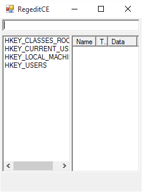
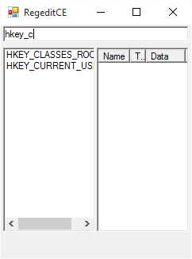
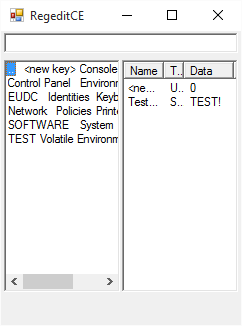
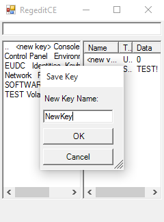
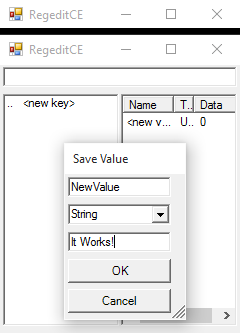

RegeditCE
=========

A simple Registry Editor for Windows CE and Windows Mobile devices.

## Software Requirements:
 * Windows CE 4.2, 5.0, and 6.0 (CE and PowerPC versions)
 * Windows Mobile 5.0 (PowerPC and Smartphone versions)
 * .NET Compact Framework v3.5 (.NET CF v3.5)
 * 32Kb storage space (16Kb for the application, 16Kb for the installer CAB)

## Installation using the CAB installer
RegeditCE comes with a convenient CAB file installer that can be quickly used to install the program onto your device. To use the CAB file installer:
1. Copy the CAB file for your platform onto your device. You may store this on the device's internal storage, or external storage if your device supports it (Compact Flash disk, SD card, Mini SD card, Micro SD card, etc.)
2. On your device, use the file browser to navigate to where the CAB file is stored
3. Double-tap on the CAB file (if your device has a touchscreen), or use a combination of the arrow keys/Enter key to launch the CAB file installer
4. Follow the prompts to install RegeditCE

If you would prefer to use RegeditCE as a standalone application (without installing it), you can simply copy the .EXE file anywhere onto your device, and run that file directly.

## Usage

When you first start the application, you will see the main screen, which will look like the following:

The main screen is split into three sections. At the top of the application, you will see a text box. This text box is a search tool, that can automatically filter the list of keys as you type:

On the left side of the main screen is the key list. This list shows a list of all keys under the current key. When the application is first started, you will see the four primary key groups, prefixed with HKEY_... From here, you can double-tap on one of the keys to navigate inside of it, and see a list of all of its sub keys.

On the right side of the main screen is the value list. This list shows all of the values that are associated with the current key.

### Adding New Keys
To add a new sub key under the current key, simply double-tap on the <new key> entry in the key list. This will open a new window that will allow you to enter the name of the new registry key. Enter the name of the new key, and click OK.

### Adding New Values
To add a new value to the current key, double-tap on the <new value> entry in the value list. This will open a new window that will allow you to enter the name of the new value, the value's data type, and the value of the value itself. Fill in the form, and click OK to create the new value.

Copyright (c) Long Technical 2012-2018